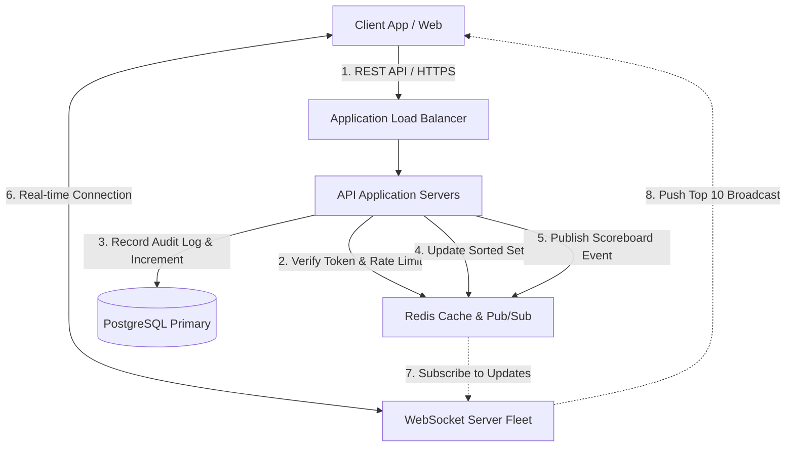
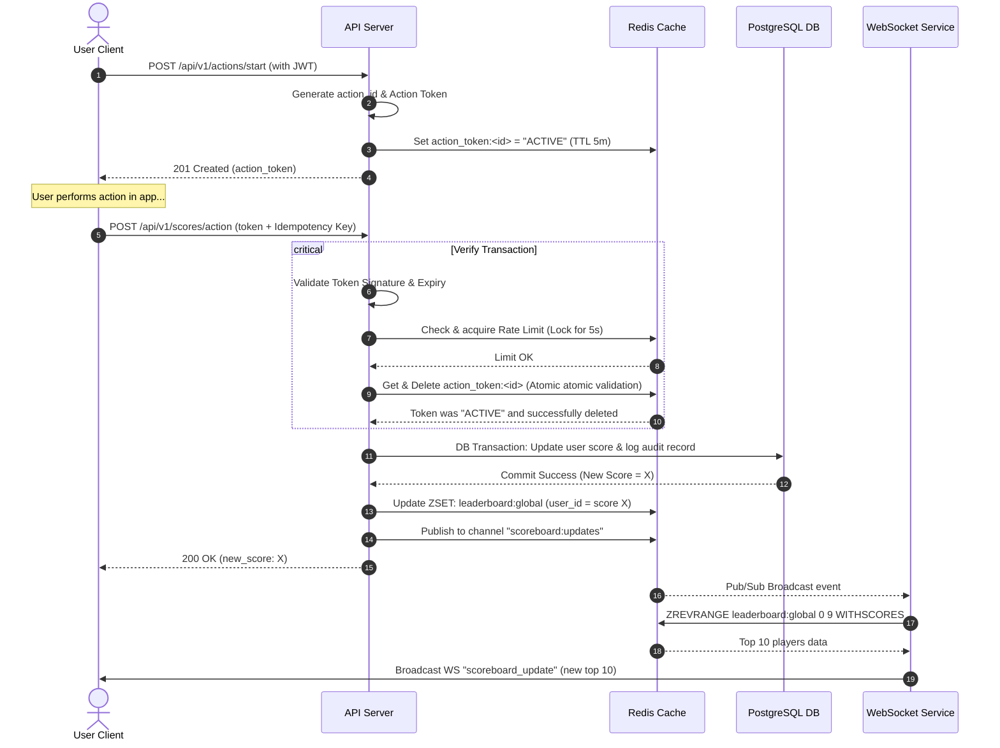
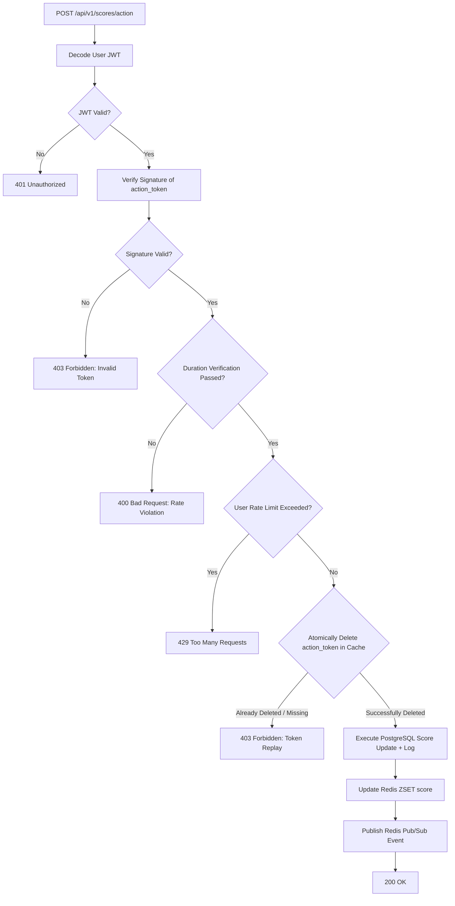

# Scoreboard API Module Specification

This document defines the system architecture, API endpoints, data models, security designs, and flow diagrams for the Scoreboard API Module. This specification serves as the implementation blueprint for the backend engineering team.

---

## 1. System Architecture

The module utilizes a high-throughput, low-latency architecture to process secure score updates and deliver real-time leaderboard updates to clients.



### Components Summary

- **Client**: Initiates actions, submits verification payloads, and establishes WebSocket connections to render the live top-10 board.
- **API Server**: Validates JWT authorization, manages action lifecycles (tokens), updates database scores, and writes cache layers.
- **PostgreSQL Database**: Acts as the single source of truth for persistent user information, total scores, and security audit trails.
- **Redis Cache (Sorted Set)**: Powers highly efficient leaderboard ranking lookup (`O(log(N))`) and updates.
- **Redis Pub/Sub**: Disseminates score updates to the horizontally scaled WebSocket server fleet.
- **WebSocket Fleet**: Manages open TCP connections with online clients and broadcasts real-time top-10 list updates.

---

## 2. Security & Anti-Cheat Specifications

To prevent malicious users from inflating scores without authorization, the system enforces a **Secure Action Token Protocol** paired with rate-limiting and server-side logic validation.

### Core Defense Mechanisms

1. **User Authentication (JWT)**
   - Every score-modifying endpoint requires a valid JSON Web Token (JWT) in the `Authorization: Bearer <JWT>` header.
   - Restricts API interaction to authenticated accounts.

2. **Action Initiation Token (Anti-Spoofing)**
   - Users cannot simply call `/api/v1/scores/action` with arbitrary parameters.
   - When a user starts an action, they must invoke `/api/v1/actions/start`. The server generates a cryptographically signed, short-lived, single-use **Action Token** (stored temporarily in Redis with a TTL of 5 minutes).
   - The token contains:
     - `userId`: Bound to the authenticated user.
     - `actionId`: A unique UUID.
     - `timestamp`: Time of initiation.
     - `signature`: Server HMAC-SHA256 signature.

3. **Action Duration Validation (Anti-Speed-Up)**
   - The server enforces a minimum physical duration required to complete the action.
   - If the action completion API call arrives faster than the logical duration window (e.g. under 2 seconds), the request is rejected as a bot/scripting attempt.

4. **Single-Use (JTI Replay Protection)**
   - Once an Action Token is submitted, it is flagged as consumed in Redis. Any attempt to reuse the same Action Token will fail.

5. **Rate Limiting**
   - **IP-Based**: Prevent DDOS.
   - **User-Based**: Enforce a strict sliding window limit in Redis (e.g., maximum of 1 action completion every 5 seconds per user).

6. **Fixed Score Increments**
   - The client **cannot** specify the score increment amount. The increment is hardcoded to **+1** in the server-side backend logic.

---

## 3. Data Models

### Database Schema (PostgreSQL)

```sql
-- User Profile & Score Persistence
CREATE TABLE users (
    id UUID PRIMARY KEY DEFAULT gen_random_uuid(),
    username VARCHAR(50) UNIQUE NOT NULL,
    total_score BIGINT NOT NULL DEFAULT 0,
    created_at TIMESTAMP WITH TIME ZONE DEFAULT CURRENT_TIMESTAMP,
    updated_at TIMESTAMP WITH TIME ZONE DEFAULT CURRENT_TIMESTAMP
);

CREATE INDEX idx_users_total_score ON users(total_score DESC);

-- Score Updates Audit Log for Investigation
CREATE TABLE score_audit_logs (
    id UUID PRIMARY KEY DEFAULT gen_random_uuid(),
    user_id UUID NOT NULL REFERENCES users(id) ON DELETE CASCADE,
    action_id UUID UNIQUE NOT NULL,
    score_delta INT NOT NULL CHECK (score_delta = 1),
    ip_address VARCHAR(45) NOT NULL,
    created_at TIMESTAMP WITH TIME ZONE DEFAULT CURRENT_TIMESTAMP
);

CREATE INDEX idx_score_audit_logs_user_id ON score_audit_logs(user_id);
```

### Redis Schema

#### Leaderboard Sorted Set (`leaderboard:global`)

- **Type**: Sorted Set (ZSET)
- **Key**: `leaderboard:global`
- **Member**: `user_id` (String)
- **Score**: `total_score` (Integer)

#### Action Token Storage (`action_token:<token_uuid>`)

- **Type**: String
- **TTL**: 300 seconds (5 minutes)
- **Value**: `"ACTIVE" | "USED"`

#### Rate Limit Tracker (`rate_limit:score:<user_id>`)

- **Type**: String
- **TTL**: 5 seconds
- **Value**: Unix Timestamp of last action

---

## 4. API Endpoints Specification

### 4.1 REST API

#### Endpoint: Start Action

- **URL**: `/api/v1/actions/start`
- **Method**: `POST`
- **Headers**:
  ```http
  Authorization: Bearer <JWT>
  Content-Type: application/json
  ```
- **Response (201 Created)**:
  ```json
  {
    "success": true,
    "action_id": "4a7b2829-873f-40c2-bd74-1296cf9be32c",
    "action_token": "eyJhbGciOiJIUzI1NiIsInR5cCI6IkpXVCJ9.eyJhY3Rpb25JZCI6IjRhN2IyODI5LTg3M2YtNDBjMi1iZDc0LTEyOTZjZjliZTMyYyIsInVzZXJJZCI6IjFhMmIzYzRkLTFlMmYzZzRoIiwiZXhwIjoxNjkzNDY0NDAwfQ...",
    "expires_at": "2026-08-24T06:35:00.000Z"
  }
  ```

---

#### Endpoint: Complete Action & Update Score

- **URL**: `/api/v1/scores/action`
- **Method**: `POST`
- **Headers**:
  ```http
  Authorization: Bearer <JWT>
  Content-Type: application/json
  X-Idempotency-Key: <UUID>
  ```
- **Request Body**:
  ```json
  {
    "action_id": "4a7b2829-873f-40c2-bd74-1296cf9be32c",
    "action_token": "eyJhbGciOiJIUzI1NiIsInR5cCI6IkpXVCJ9..."
  }
  ```
- **Response (200 OK)**:
  ```json
  {
    "success": true,
    "message": "Score successfully updated",
    "data": {
      "user_id": "1a2b3c4d-1e2f-3g4h",
      "new_score": 142
    }
  }
  ```
- **Error Codes**:
  - `400 Bad Request`: Validation errors (token format, timestamp validation mismatch).
  - `401 Unauthorized`: Missing or invalid JWT credentials.
  - `403 Forbidden`: Token is already used, expired, or invalid HMAC signature.
  - `429 Too Many Requests`: User-based rate limits exceeded.

---

#### Endpoint: Get Top 10 Scores (Fallback / Hydration)

- **URL**: `/api/v1/scores/top`
- **Method**: `GET`
- **Headers**: None required.
- **Response (200 OK)**:
  ```json
  {
    "success": true,
    "scoreboard": [
      { "rank": 1, "username": "Alice", "score": 950 },
      { "rank": 2, "username": "Bob", "score": 875 },
      { "rank": 3, "username": "Charlie", "score": 820 },
      { "rank": 4, "username": "David", "score": 810 },
      { "rank": 5, "username": "Eve", "score": 790 },
      { "rank": 6, "username": "Frank", "score": 750 },
      { "rank": 7, "username": "Grace", "score": 725 },
      { "rank": 8, "username": "Heidi", "score": 700 },
      { "rank": 9, "username": "Ivan", "score": 690 },
      { "rank": 10, "username": "Jack", "score": 680 }
    ]
  }
  ```

---

### 4.2 WebSocket API

Used for broadcasting live top 10 scorecard updates.

- **URL**: `/ws/scoreboard`
- **Protocol**: `WSS`
- **Connection Handshake**:
  - Client connects to the socket.
  - Client immediately receives the current Top 10 list on successful connection.
- **Outgoing Event from Server**: `scoreboard_update`
  ```json
  {
    "event": "scoreboard_update",
    "timestamp": 1792823400000,
    "scoreboard": [
      { "rank": 1, "username": "Alice", "score": 951 },
      { "rank": 2, "username": "Bob", "score": 875 },
      { "rank": 3, "username": "Charlie", "score": 820 },
      ...
    ]
  }
  ```

---

## 5. Flow of Execution

### 5.1 End-to-End Score Update Sequence



---

### 5.2 Token Lifecycle Validation Flowchart



---

## 6. Performance & Scale Optimizations

1. **Redis Sorted Sets (Leaderboard Calculation)**
   - Leaderboards calculated via traditional relational `ORDER BY` models query database indices but degrade when datasets grow large.
   - By implementing Redis ZSET (`leaderboard:global`), adding scores is `O(log(N))` and fetches top 10 is `O(1)` operations.
2. **WebSocket Scaling (Redis Pub/Sub)**
   - In production, multiple WebSocket application instances operate behind a load balancer.
   - A single websocket server cannot monitor database transactions directly. Using Redis Pub/Sub, any server instance receiving an update notifies all WebSocket nodes, causing them to push updates to their locally connected subscribers.

3. **Debounced/Throttled Broadcasts**
   - High traffic results in hundreds of updates per second. Sending updates over WebSockets per score tick floods client bandwidth.
   - **Recommendation**: WebSocket servers should throttle broadcasts. Rather than pushing updates immediately, implement a 500ms debounce loop that sends only the latest top 10 state.

---

## 7. Additional Improvements & Recommendations

Backend development teams should consider the following optimization strategies during implementation:

- **Database Partitioning for Audit Log Table**: The `score_audit_logs` table will grow rapidly. Partitioning this table by month or archiving old logs dynamically maintains database execution times.
- **Fallback Strategy on Cache Eviction**: If Redis fails, configure a fallback to query the PostgreSQL indexed query:
  ```sql
  SELECT username, total_score FROM users ORDER BY total_score DESC LIMIT 10;
  ```
- **Time-Based Leaderboards (Extension Path)**:
  To support Daily, Weekly, or Monthly scoreboards, use separate ZSET keys:
  - `leaderboard:daily:2026-08-24`
  - `leaderboard:weekly:2026-W34`
    Use Redis key expiration policies to clean up old cache datasets automatically.
- **Asynchronous Processing (High Scalability Option)**:
  If processing database writes synchronously degrades load performance during spike events, update scores immediately in Redis ZSET (serving live reads) and push audit updates to an asynchronous message queue (e.g., RabbitMQ, Kafka) to write data persistence tasks in batches.
